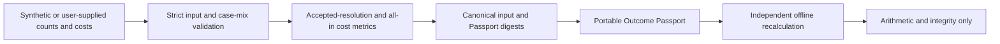
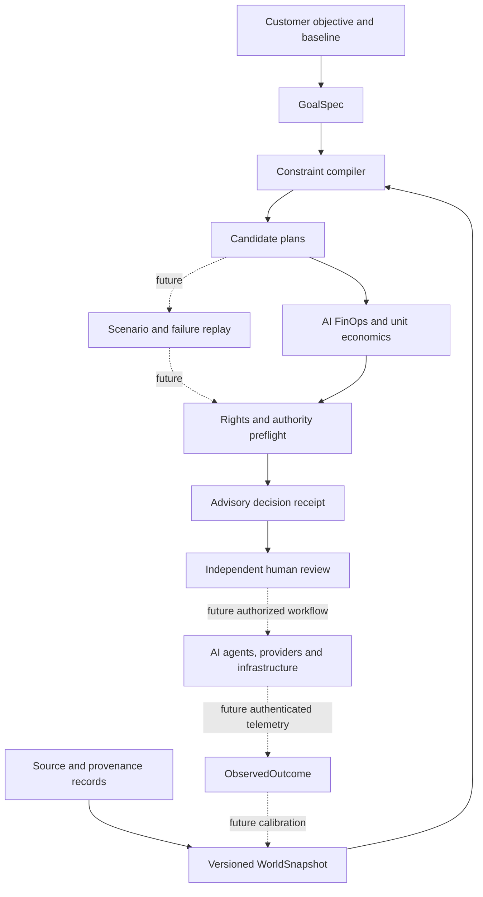
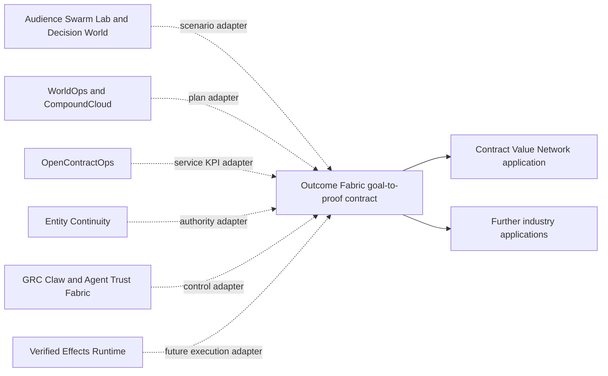

# Outcome Fabric: Agentic AI Platform for AI Infrastructure, FinOps, and Governance

**Compile an enterprise objective into a feasible AI service plan, compare its unit economics, and preserve an inspectable decision receipt.**

## Outcome Evidence Bridge: local support-export reference

The Bridge now reads **local CSV exports only** and reconciles support cases, acceptance decisions, and seven explicit cost categories into an aggregate Outcome Passport. It checks the file digests declared in a manifest, requires one decision for every case, rejects duplicate case IDs and missing cost categories, and omits case IDs and raw source rows from the resulting package. Its verifier re-reads the exports and recomputes the complete package.

```bash
PYTHONPATH=src python3 -m outcome_fabric.bridge_cli build fixtures/bridge/manifest.json --output /tmp/bridge-package.json
PYTHONPATH=src python3 -m outcome_fabric.bridge_cli verify fixtures/bridge/manifest.json /tmp/bridge-package.json
```

The fixture is **synthetic**: the baseline has five eligible cases, four accepted cases, and $160 total cost ($40 per accepted resolution); the candidate has five eligible and accepted cases and $130 cost ($26 per accepted resolution). This tiny case proves reconciliation and arithmetic only. It is not evidence of real savings or causal lift.

See [the Bridge contract and trust boundaries](docs/EVIDENCE_BRIDGE.md) before using customer exports. The `CUSTOMER_SUPPLIED_UNVERIFIED` label means exactly that: the local tool cannot authenticate export origin, permission, review, or completeness. Do not publish customer-derived packages without a separate customer-approved process.

## Outcome Passport: public reference implementation

The open-source Passport extension converts explicit case counts and seven cost categories into a deterministic, portable measurement record. It has a separate verifier that recomputes the entire record and rejects altered metrics, evidence labels, or digests. The included support example is **entirely synthetic**. A passing verification means internal arithmetic and file integrity are consistent; it does **not** authenticate a source, prove customer consent, establish causality, or verify realized savings.

```bash
PYTHONPATH=src python3 -m outcome_fabric.passport_cli generate fixtures/support-passport-synthetic.json --output /tmp/support-passport.json
PYTHONPATH=src python3 -m outcome_fabric.passport_cli verify /tmp/support-passport.json
PYTHONPATH=src python3 -m unittest discover -s tests -v
```

The synthetic baseline has 800 accepted resolutions among 1,000 eligible cases and $28,000 in attributable cost: **$35.00 per accepted resolution**. The synthetic candidate has 850 accepted resolutions and $23,900 in cost: **$28.1176 per accepted resolution**. The displayed $6.8824 difference is descriptive arithmetic over invented inputs, not a real saving or causal estimate.



The input contract requires a workload and deployment label, a named and versioned protocol, an acceptance rule, a measurement window, a currency, and baseline/candidate arms. Each arm needs eligible and accepted case counts, case-mix category counts, and **all seven** cost categories: inference, retrieval, infrastructure, human QA, rework, operations, and allocated setup. Missing categories, invalid counts, or negative/nonfinite costs fail closed. A cost difference is withheld unless both arms have identical case-mix counts. Even identical aggregate counts do not prove equal case difficulty.

Only `SYNTHETIC` and `CUSTOMER_SUPPLIED_UNVERIFIED` are accepted evidence classes. The CLI never outputs an independently verified or publication-approved claim. The schema is implemented in `src/outcome_fabric/passport.py`; `fixtures/support-passport-synthetic.json` is the reproducible example. Version 0.1.0 of the Passport contract is intentionally narrow and should be versioned before adding source attestations, consent records, uncertainty analysis, or public publication workflows.

### Release boundary

| Open-source now | Requires a later, consented product workflow |
| --- | --- |
| Portable input and output contract; deterministic calculator and verifier | Authenticated customer connectors and source-level verification |
| Synthetic support case; tests and CI | Customer-controlled private evidence storage and approvals |
| Explicit cost denominator, evidence label, and limitations | Independent review, dispute handling, and publication consent |
| Offline local use without accounts or credentials | Cross-customer comparisons and buyer matching |

The next evidence gate is a **read-only pilot** in which a customer defines acceptance, supplies permitted source records, and reviews the cost allocation. Do not publish a customer result or call it verified merely because this CLI passes. A future commercial exchange should be evaluated only after comparable, customer-approved pilots exist.

Outcome Fabric is an open-source reference kernel for an eventual goal-to-proof platform. This first version evaluates a **synthetic private AI customer-support deployment**. It compares cost, delivery time, quality, availability, data residency, and declared approval evidence. It deliberately does not deploy infrastructure, run agents, authenticate people, or prove realized savings.

The most useful discovery phrases for this project are **agentic AI platform**, **AI infrastructure**, **AI FinOps**, **AI governance**, and **AI agent evaluation**. They describe real parts of the product. No public source consulted for this release provides reliable absolute search volumes or proves this exact ranking. [Google Trends normalizes interest to 0–100 rather than publishing absolute query counts](https://support.google.com/trends/answer/4365533?hl=en); the keyword choices are hypotheses to validate with Search Console and a licensed keyword dataset after publication.

## Run the executable case

Python 3.11+ is sufficient. No third-party runtime dependencies or credentials are required.

```bash
cd outcome-fabric
PYTHONPATH=src python3 -m outcome_fabric.cli fixtures/ai-support-service.json --output /tmp/outcome-receipt.json
PYTHONPATH=src python3 -m unittest discover -s tests -v
```

The reference case has three plans. The least expensive plan fails its residency and approval-evidence assumptions. A second plan meets all declared gates. The premium local plan misses the delivery deadline and budget. The output contains the full rejected-plan reasons, cost breakdown, input digest, and `ADVISORY_ONLY_NOT_AUTHORIZED` label. The fixture's dollars and performance figures are invented; the displayed savings are arithmetic relative to an invented baseline, not a measured economic result.

## Product architecture



Solid arrows show the reference design represented in the current CLI. Dotted arrows are **future integration boundaries**. The local kernel implements validation, plan comparison, elementary economics, and a declared-evidence preflight; it does not implement scenario replay, authenticated human approval, or outcome capture.

## Where this fits with existing A2Z projects



These are intended contracts, **not claimed live integrations**. Each project keeps its own domain logic. Outcome Fabric owns only the cross-domain objective, plan, evaluation, and outcome envelope.

## OSS and commercial boundary

| Inspectable OSS kernel | Proposed commercial Outcome Network |
| --- | --- |
| Versioned goal, plan, rights and outcome schemas | Tenant-specific operational twin and private integrations |
| Constraint compiler and deterministic economics | Identity, authenticated approvals and durable workflows |
| Synthetic fixtures and baseline comparisons | Licensed market intelligence and partner capacity |
| Advisory receipts and verifier | Permissioned evidence room and independent outcome review |
| Framework-neutral adapter contracts | Managed delivery, support and contractual service levels |

The commercial layer cannot be credible until real customers authorize data access, partners are vetted, approvals are authenticated, and observed outcomes are reconciled to invoices and acceptance records. Customer documents, personal contacts, negotiated provider prices, and licensed datasets do not belong in the public repository.

## Evaluation and release gates

1. **Reference kernel:** reproduce the synthetic case and ensure the cheapest noncompliant candidate is rejected.
2. **Held-out benchmark:** compare against cheapest-plan and fastest-plan baselines; measure constraint violations, cost arithmetic error, unsupported claims, and reproducibility.
3. **Read-only pilot:** ingest customer-authorized baseline data, independently review assumptions, and measure forecast error without executing changes.
4. **Controlled execution:** use authenticated approvals, a durable workflow, and real acceptance evidence before calling any result delivered.
5. **Calibrated product:** report predicted-versus-observed cost, quality, and time across multiple customers; publish aggregate benchmarks only with appropriate rights and privacy protection.

The commercial unit of value is **one accepted and measured customer objective**. Useful KPIs include cost per resolved case, accepted-resolution rate, time to launch, availability, operator hours, gross margin, collection delay, forecast error, and approval bypass rate. [FinOps Foundation's 2026 report](https://data.finops.org/) identifies AI cost management as a major practitioner need, while the [CNCF cloud-native survey](https://www.cncf.io/reports/the-cncf-annual-cloud-native-survey/) documents AI infrastructure's production significance. These are market-context signals, not proof of demand for this repository.

## Keyword and content plan

| Search intent hypothesis | Honest page or artifact to publish |
| --- | --- |
| AI agent platform / agentic AI platform | This overview and the executable goal-to-proof demo |
| AI infrastructure planning | WorldOps/CompoundCloud adapter specification and benchmark |
| AI FinOps / AI cost optimization | Cost-per-case calculator with explicit assumptions |
| AI governance for agents | Authority preflight and failure-case benchmark |
| AI agent evaluation | Held-out plan-selection benchmark with simple baselines |

Use concise, descriptive page titles and real examples rather than repeating keywords. That is consistent with [Google Search Central's guidance](https://developers.google.com/search/docs/appearance/title-link).

## Limitations

- All providers, prices, quality scores, and approvals in the fixture are fictional.
- `authorization_evidence: present` is a supplied claim, not authenticated identity or a valid approval.
- The ranking minimizes cost among plans that pass the declared gates; it does not optimize a full stochastic or multi-period model.
- Savings are modeled cost differences only. They exclude causal attribution, taxes, financing, and unlisted costs.
- No customer integration, live agent orchestration, contract execution, or production infrastructure action exists in v0.1.

License: MIT. See [LICENSE](LICENSE).
