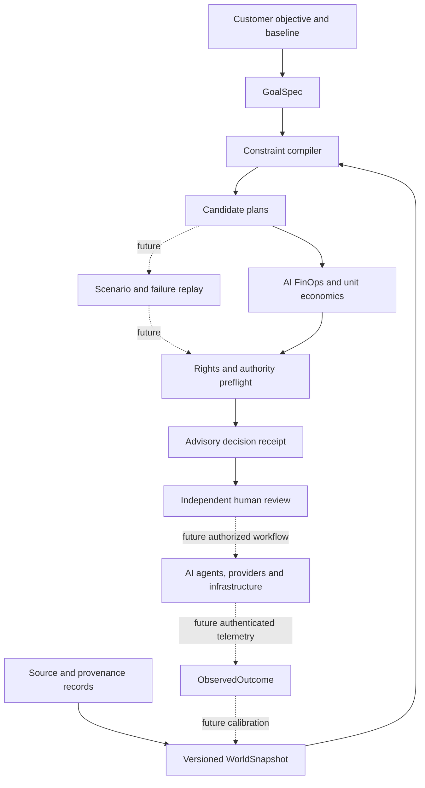
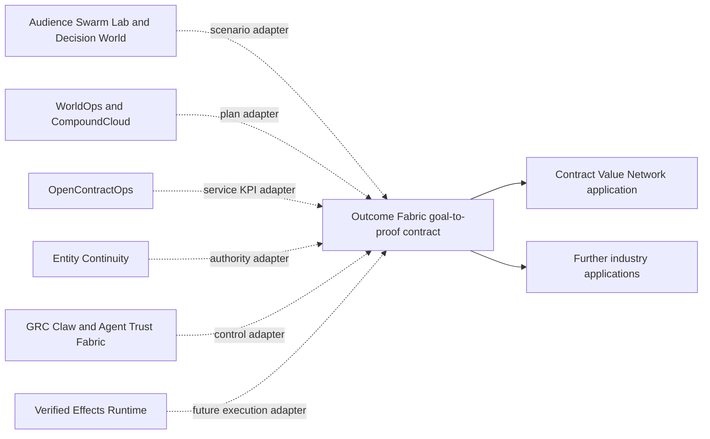

# Outcome Fabric: Agentic AI Platform for AI Infrastructure, FinOps, and Governance

**Compile an enterprise objective into a feasible AI service plan, compare its unit economics, and preserve an inspectable decision receipt.**

Outcome Fabric is an open-source reference kernel for an eventual goal-to-proof platform. This first version evaluates a **synthetic private AI customer-support deployment**. It compares cost, delivery time, quality, availability, data residency, and declared approval evidence. It deliberately does not deploy infrastructure, run agents, authenticate people, or prove realized savings.

The most useful discovery phrases for this project are **agentic AI platform**, **AI infrastructure**, **AI FinOps**, **AI governance**, and **AI agent evaluation**. They describe real parts of the product. No public source consulted for this release provides reliable absolute search volumes or proves this exact ranking. [Google Trends normalizes interest to 0–100 rather than publishing absolute query counts](https://support.google.com/trends/answer/4365533?hl=en); the keyword choices are hypotheses to validate with Search Console and a licensed keyword dataset after publication.

## Run the executable case

Python 3.11+ is sufficient. No third-party runtime dependencies or credentials are required.

```bash
cd outcome-fabric
PYTHONPATH=src python3 -m outcome_fabric.cli fixtures/ai-support-service.json --output /tmp/outcome-receipt.json
PYTHONPATH=src python3 -m unittest discover -s tests -v
```

The reference case has three plans. The least expensive plan fails its residency and approval-evidence assumptions. A second plan meets all declared gates. The premium local plan misses the delivery deadline and budget. The output contains the full rejected-plan reasons, cost breakdown, input digest, and `ADVISORY_ONLY_NOT_AUTHORIZED` label. The fixture's dollars and performance figures are invented; the displayed savings are arithmetic relative to an invented baseline, not a measured economic result.

## Product architecture



Solid arrows show the reference design represented in the current CLI. Dotted arrows are **future integration boundaries**. The local kernel implements validation, plan comparison, elementary economics, and a declared-evidence preflight; it does not implement scenario replay, authenticated human approval, or outcome capture.

## Where this fits with existing A2Z projects



These are intended contracts, **not claimed live integrations**. Each project keeps its own domain logic. Outcome Fabric owns only the cross-domain objective, plan, evaluation, and outcome envelope.

## OSS and commercial boundary

| Inspectable OSS kernel | Proposed commercial Outcome Network |
| --- | --- |
| Versioned goal, plan, rights and outcome schemas | Tenant-specific operational twin and private integrations |
| Constraint compiler and deterministic economics | Identity, authenticated approvals and durable workflows |
| Synthetic fixtures and baseline comparisons | Licensed market intelligence and partner capacity |
| Advisory receipts and verifier | Permissioned evidence room and independent outcome review |
| Framework-neutral adapter contracts | Managed delivery, support and contractual service levels |

The commercial layer cannot be credible until real customers authorize data access, partners are vetted, approvals are authenticated, and observed outcomes are reconciled to invoices and acceptance records. Customer documents, personal contacts, negotiated provider prices, and licensed datasets do not belong in the public repository.

## Evaluation and release gates

1. **Reference kernel:** reproduce the synthetic case and ensure the cheapest noncompliant candidate is rejected.
2. **Held-out benchmark:** compare against cheapest-plan and fastest-plan baselines; measure constraint violations, cost arithmetic error, unsupported claims, and reproducibility.
3. **Read-only pilot:** ingest customer-authorized baseline data, independently review assumptions, and measure forecast error without executing changes.
4. **Controlled execution:** use authenticated approvals, a durable workflow, and real acceptance evidence before calling any result delivered.
5. **Calibrated product:** report predicted-versus-observed cost, quality, and time across multiple customers; publish aggregate benchmarks only with appropriate rights and privacy protection.

The commercial unit of value is **one accepted and measured customer objective**. Useful KPIs include cost per resolved case, accepted-resolution rate, time to launch, availability, operator hours, gross margin, collection delay, forecast error, and approval bypass rate. [FinOps Foundation's 2026 report](https://data.finops.org/) identifies AI cost management as a major practitioner need, while the [CNCF cloud-native survey](https://www.cncf.io/reports/the-cncf-annual-cloud-native-survey/) documents AI infrastructure's production significance. These are market-context signals, not proof of demand for this repository.

## Keyword and content plan

| Search intent hypothesis | Honest page or artifact to publish |
| --- | --- |
| AI agent platform / agentic AI platform | This overview and the executable goal-to-proof demo |
| AI infrastructure planning | WorldOps/CompoundCloud adapter specification and benchmark |
| AI FinOps / AI cost optimization | Cost-per-case calculator with explicit assumptions |
| AI governance for agents | Authority preflight and failure-case benchmark |
| AI agent evaluation | Held-out plan-selection benchmark with simple baselines |

Use concise, descriptive page titles and real examples rather than repeating keywords. That is consistent with [Google Search Central's guidance](https://developers.google.com/search/docs/appearance/title-link).

## Limitations

- All providers, prices, quality scores, and approvals in the fixture are fictional.
- `authorization_evidence: present` is a supplied claim, not authenticated identity or a valid approval.
- The ranking minimizes cost among plans that pass the declared gates; it does not optimize a full stochastic or multi-period model.
- Savings are modeled cost differences only. They exclude causal attribution, taxes, financing, and unlisted costs.
- No customer integration, live agent orchestration, contract execution, or production infrastructure action exists in v0.1.

License: MIT. See [LICENSE](LICENSE).
