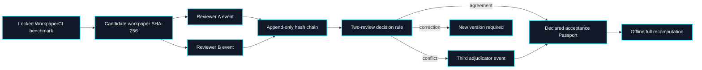

# Acceptance Ledger: local declared review of exact workpaper versions

Acceptance Ledger is a local, inspectable extension of WorkpaperCI. It records two primary review decisions for an exact candidate workpaper digest, optionally records a third adjudication when the primary reviewers disagree, and recomputes a scope-limited Passport offline. The committed demo events are **synthetic**. Local reviewer aliases, timestamps, and hourly-rate assumptions are **not authenticated**; no result is evidence of a professional review or customer permission.

## Run the synthetic reference

```bash
PYTHONPATH=src python3 -m outcome_fabric.acceptance_ledger_cli evaluate fixtures/acceptance-ledger-config.json fixtures/acceptance-ledger/demo-events.jsonl --output /tmp/acceptance-ledger-passport.json
PYTHONPATH=src python3 -m outcome_fabric.acceptance_ledger_cli verify fixtures/acceptance-ledger-config.json fixtures/acceptance-ledger/demo-events.jsonl /tmp/acceptance-ledger-passport.json
```

The five-task fixture has four simulated declared acceptances, one correction request, and one conflict resolved by a simulated third reviewer. It reports zero authenticated acceptances. Its $13.27 modeled cost per declared acceptance uses invented run costs, 74 declared review minutes, and an invented $40/hour rate. It is a mechanics test, not observed unit economics.

## Local review UI

Keep the event file outside the repository for interactive testing. The server binds to `127.0.0.1`, presents the public filing task and candidate claims, and writes one hash-linked event per form submission. It has no login or identity verification. The commands below use the committed `SIMULATED_FIXTURE` configuration, so their output stays labeled as a demo even when a person uses the form. A separately prepared, permissioned local pilot must use `OPERATOR_DECLARED_UNAUTHENTICATED` and its own locked benchmark and event file.

```bash
PYTHONPATH=src python3 -m outcome_fabric.acceptance_ledger_cli serve fixtures/acceptance-ledger-config.json /tmp/my-review-events.jsonl --port 8765
# Open http://127.0.0.1:8765/ in a local browser.
```

For shell-only use, append a review with `record`:

```bash
PYTHONPATH=src python3 -m outcome_fabric.acceptance_ledger_cli record fixtures/acceptance-ledger-config.json /tmp/my-review-events.jsonl --task apple-fy2021 --reviewer reviewer_a --action REVIEW --decision ACCEPT --minutes 6
```

Rejections and correction requests require a note. A reviewer alias may act only once on the same workpaper version. Two primary reviewers must have distinct aliases; a conflict needs a third distinct alias. The browser form shows the submitted and source values, but does not reveal the submission's agent label. It is suitable for testing the workflow with public fixture data only.

## Evidence and decision flow



Each event records task ID, candidate workpaper digest, reviewer alias, action, decision, declared minutes, note, timestamp, claim-level findings, prior-event hash, and its own hash. A finding identifies a claim, `MATERIAL` or `MINOR` severity, a reason, and an optional proposed value. Correction requests require at least one finding. File locking serializes local writers on macOS and Linux. If the candidate workpaper changes, old events remain in the ledger but are counted as stale; they cannot accept the new digest. A hash chain reveals changes relative to a trusted previously retained head hash. It does not prevent a person with full file access from replacing the whole ledger and its head, and it does not authenticate identities.

| Primary decisions | Outcome |
| --- | --- |
| Fewer than two | Await two reviews |
| Both accept, automated checks clean | Declared acceptance of exact version |
| Both reject | Declared rejection |
| Either requests correction | New version required |
| One accepts, one rejects | Await distinct adjudicator |
| Automated check fails | Hold even if reviewers accept |

The current demo does not create or edit revised workpapers. Revision requires a new WorkpaperCI candidate submission and benchmark lock, then fresh reviews of its new digest. Notes record requests; they are not edits to the original workpaper.

## Cost and claim boundary

Modeled task cost is the candidate's **estimated** model, data, compute and allocated-setup costs, plus declared reviewer minutes multiplied by the configured hourly rate. The benchmark's synthetic review and rework categories are excluded to avoid counting review twice. All attempted tasks remain in the numerator. The denominator is the number of declared acceptances; if it is zero, unit cost is `null`. The summary also reports raw agreement among pairs of primary reviewers; the five-task fixture is too small for a meaningful general agreement claim.

This is not measured financial performance. The public fixture uses one issuer across five years, a small fixed rubric, and simulated reviewers. The next evidence milestone requires independent qualified reviewers, a larger task set, actual time measurement, source rights, and review of disagreements. A commercial workflow would also need authenticated reviewer identity, access control, private data custody, retention rules, and a customer-approved publication path; none are claimed in this OSS reference.
