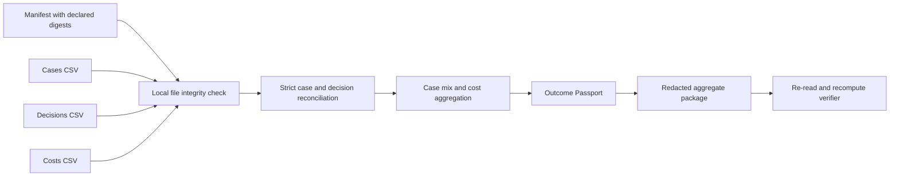

# Outcome Evidence Bridge v0.1

The Bridge is an offline, read-only reference implementation for the first customer-support measurement vertical. It ingests three local CSV files named in a JSON manifest and emits an aggregate evidence package containing an Outcome Passport. It never calls a customer API, modifies a source system, sends data over a network, authenticates a person, or approves publication.

## Data flow

The package contains aggregate case mix and costs, source SHA-256 digests and row counts, the manifest digest, a Passport, and explicit limitations. It excludes source file paths, case IDs, raw decisions, and raw rows. **The aggregate package may still be commercially sensitive.** Store or share it only as authorized by the data owner.

## Input contract

The manifest is `fixtures/bridge/manifest.json` in the example. It requires:

- `schema_version: "0.1.0"`, `passport_id`, `subject`, and the Outcome Passport `protocol`.
- `evidence_class` of `SYNTHETIC` or `CUSTOMER_SUPPLIED_UNVERIFIED`.
- `permission_status: "DECLARED_BY_OPERATOR_NOT_VERIFIED"` and `baseline_status: "DECLARED_LOCKED_NOT_AUTHENTICATED"`. These are warnings, not approvals.
- Three `sources` entries, each with a relative `.csv` path and the lowercase SHA-256 digest of the exact file bytes. Absolute and parent-escaping paths are rejected.

CSV headers are exact and case-sensitive:

| File | Columns | Rule |
| --- | --- | --- |
| cases | `case_id,arm,category` | One unique ID per eligible case; arm is `baseline` or `candidate` |
| decisions | `case_id,accepted` | Exactly one decision per case; accepted is lowercase `true` or `false` |
| costs | `arm,category,amount,currency` | All seven categories must appear in each arm; amounts are nonnegative decimal currency units with no more than two fractional digits |

The seven categories are `inference`, `retrieval`, `infrastructure`, `human_qa`, `rework`, `operations`, and `allocated_setup`. Repeated cost rows within a category are added. The currency in every row must match the Passport protocol. Costs are **arm-level allocations**, so the operator must disclose the allocation method outside this v0.1 contract before interpreting a real case.

## What the release verifies

The Bridge checks source bytes against **operator-declared** hashes, CSV shape, unique IDs, complete case-to-decision joins, valid cost entries, and Passport arithmetic. Its verifier rebuilds the package from the same local sources. Those checks detect accidental or deliberate changes after the manifest was prepared; they cannot establish who prepared the manifest or whether the source export was complete and permitted.

The package's scope is `LOCAL_FILE_INTEGRITY_AND_INTERNAL_CONSISTENCY_ONLY`. The Passport's scope remains `ARITHMETIC_AND_INTEGRITY_ONLY_NOT_SOURCE_AUTHENTICATED`. No signature, independent review, customer approval, or causal claim is inferred. A hash proves consistency with a file, not truth about the underlying business event.

## Measurement and comparison

The primary metric is total attributable cost divided by accepted resolutions. The package also carries eligible and accepted counts, acceptance rate, total costs, and case mix. The current Passport withholds the simple baseline-versus-candidate cost delta when case-mix category counts differ. Matching counts do not prove comparable difficulty, and this release does not estimate confidence intervals or causal effects.

Before a consented pilot, a customer and reviewer should lock the eligibility and acceptance rubric, measurement windows, rework window, exclusion rules, cost allocation, retention period, publication rights, and exception process. The current manifest merely records declared text; it does not enforce a legal agreement or authenticate a baseline lock.

## Operational limits and next gates

1. **Current:** local synthetic CSV fixture, deterministic aggregation, negative tests, offline verifier.
2. **Read-only customer pilot:** customer-prepared, permissioned exports; a documented protocol; private exception review; human checks against source-system totals.
3. **Stronger evidence:** authenticated export attestations, reviewer identity and scope, consent records, uncertainty analysis, correction history, and explicit publication approval.
4. **Managed service:** private evidence storage, scoped access, monitoring, and buyer-facing comparisons only after repeatable customer-approved pilots.

Keep raw customer exports out of the repository. The test fixture is invented and contains no real customer records.
