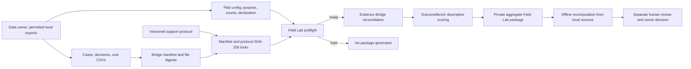
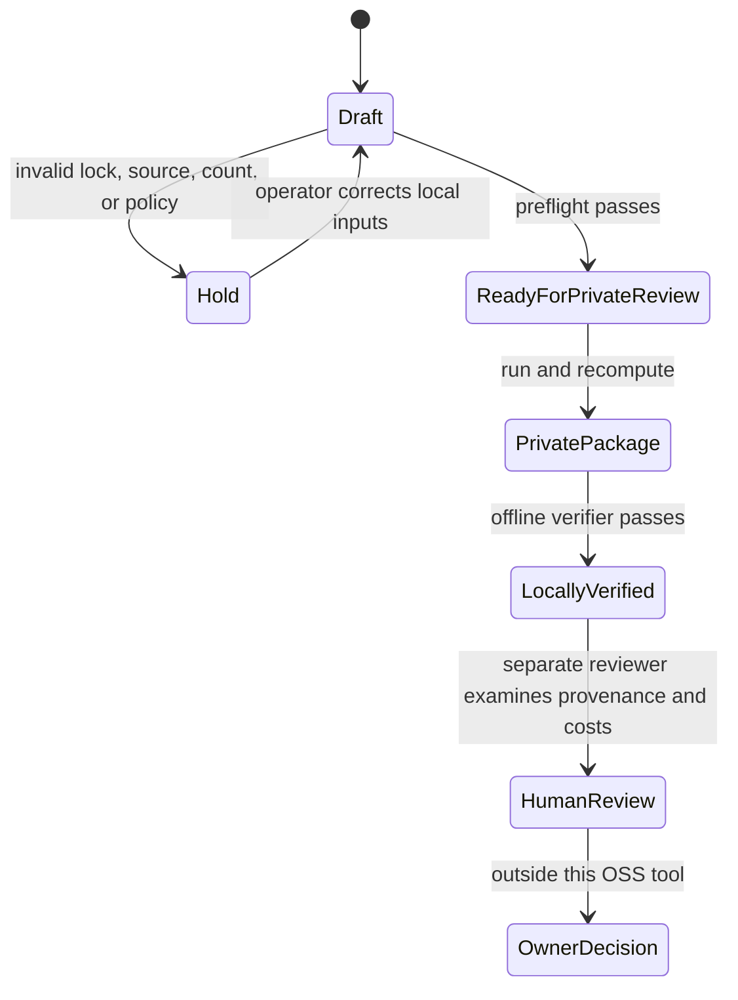

# OutcomeBench Field Lab: private pilot reference

Field Lab is a local, read-only workflow for testing whether a support-outcome benchmark can be reproduced before any customer result is shared. This release contains an executable **synthetic** pilot. It does not connect to a customer system, authenticate consent or source origin, establish causal lift, or perform an independent review.

## Run the reference pilot

Python 3.11+ is sufficient. Keep all outputs in a private location. The fixture contains only invented support records.

```bash
PYTHONPATH=src python3 -m outcome_fabric.fieldlab_cli preflight fixtures/fieldlab/pilot.json
PYTHONPATH=src python3 -m outcome_fabric.fieldlab_cli run fixtures/fieldlab/pilot.json --output /tmp/fieldlab-private.json
PYTHONPATH=src python3 -m outcome_fabric.fieldlab_cli verify fixtures/fieldlab/pilot.json /tmp/fieldlab-private.json
```

`preflight` reports `READY_FOR_PRIVATE_REVIEW` or `HOLD` with a machine-readable issue code. `run` writes an aggregate package only after all checks pass. `verify` rereads the locked sources and protocol and recomputes the complete result. A checksum establishes local integrity against the files available at verification time; it cannot prove that the original exports were complete or authentic.

## Data and control flow



The pilot config requires a stable pilot ID, a purpose, an explicit permission declaration, fixed expected case and source-row counts, and SHA-256 locks for the manifest and protocol. Those JSON files must be inside the pilot directory. The manifest in turn fixes digests for the three CSV exports. The configured publication policy is `PRIVATE_ONLY_NO_AUTOMATIC_EXPORT`; any other value fails preflight. Source rows and case IDs are not copied to the aggregate package.

## Trust and claim states



The executable states end at `LocallyVerified`. `HumanReview` and `OwnerDecision` are external processes, not status claims emitted by the CLI. The package always says `NOT_INDEPENDENTLY_REVIEWED` and `PRIVATE_ONLY_NO_AUTOMATIC_EXPORT`.

| Field Lab control | What it establishes | What remains unproven |
| --- | --- | --- |
| Manifest and protocol hashes | Local files match declared locks | Who created or approved them |
| CSV reconciliation | Every recorded case has a decision; required costs and counts agree | Source-system completeness or truth |
| Synthetic evidence label | The bundled demo is invented | Real-world performance |
| `CUSTOMER_SUPPLIED_UNVERIFIED` label | Operator declared a customer data path | Consent, lawful use, source identity, or review |
| Offline verifier | Same local inputs reproduce the package | Causal savings or generalization |

The 40-per-arm synthetic fixture reaches the protocol sample gate and produces a descriptive comparison. It repeats case templates; independence is not established, so confidence intervals are withheld. No production recommendation is generated. See [OutcomeBench architecture](OUTCOMEBENCH_ARCHITECTURE.md) for the scorecard gates and [Evidence Bridge](EVIDENCE_BRIDGE.md) for source contracts.

## Pilot file contract

`fixtures/fieldlab/pilot.json` is the exact working example. Its fields are `schema_version`, `pilot_id`, `purpose`, `permission_declaration`, `publication_policy`, `manifest`, `protocol`, `expected_case_counts`, and `expected_source_rows`. Only the two explicit declarations below are recognized:

| Declaration | Required manifest evidence class |
| --- | --- |
| `SYNTHETIC_NO_CUSTOMER_DATA` | `SYNTHETIC` |
| `OPERATOR_ASSERTED_PERMISSION_NOT_AUTHENTICATED` | `CUSTOMER_SUPPLIED_UNVERIFIED` |

For a customer pilot, the customer must authorize the data use outside this tool, choose the acceptance rule and measurement window, approve cost allocation, and retain control of the local exports. Before publishing any result, an independent process would need to establish provenance, privacy, representativeness, review and explicit publication rights. Never commit customer exports or private packages to this repository.

## OSS and prospective service boundary

The OSS release includes strict input contracts, local replay, deterministic arithmetic, hold codes, and offline verification. A prospective managed service could add authenticated customer connectors, role-based approvals, evidence custody, reviewer attestations, and recurring monitored comparisons. Those components are not present here. The first commercial proof point would be a customer-authorized, independently reviewed pilot whose measured result survives a challenge to baseline choice, source completeness, and cost allocation.
