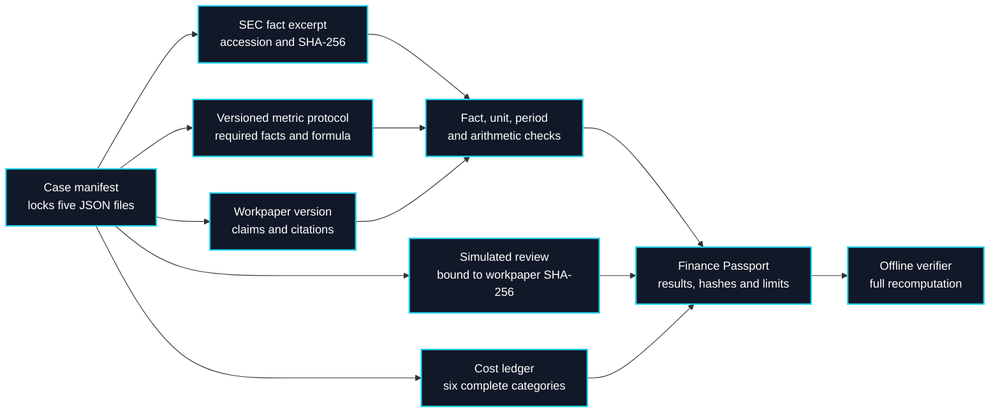
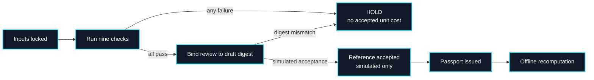

# Finance Workpaper Passport: offline reference

This is the first executable finance vertical in Outcome Fabric. It checks an issuer data pack against a locked local excerpt of Apple Inc.'s FY2025 facts from the [SEC Company Facts API](https://data.sec.gov/api/xbrl/companyfacts/CIK0000320193.json). The source excerpt names filing accession `0000320193-25-000079`, the fact concepts, periods, units, and values. The downloaded response is not independently attested; the committed excerpt is the material actually verified offline. The reviewer and costs in the example are **simulated**.

```bash
PYTHONPATH=src python3 -m outcome_fabric.finance_workpaper_cli build fixtures/finance-workpaper/case.json --output /tmp/finance-workpaper-passport.json
PYTHONPATH=src python3 -m outcome_fabric.finance_workpaper_cli verify fixtures/finance-workpaper/case.json /tmp/finance-workpaper-passport.json
```

The reference checks eight reported values plus operating margin, requiring matching fact IDs, units, periods and values. It binds a simulated acceptance to the exact workpaper digest and reports the invented all-in cost of $4.85 per accepted reference workpaper. A mismatch produces `HOLD` and suppresses the accepted-workpaper unit-cost claim. It does not provide investment advice, authenticate a human reviewer, assess whether a filing is complete, or validate any investment conclusion.

## High-contrast provenance architecture

The previous ER-style rendering could show low-contrast rows in some themes. This diagram uses explicit dark fills and white text for every node, and simple arrows that render in GitHub Mermaid.



Each lock is a relative path confined to the case directory and a lowercase SHA-256 digest. The Passport stores those digests, check results and aggregates. Verification rereads all five inputs and compares the complete recomputed Passport. The checks prove consistency with the committed excerpt, not independent provenance of the SEC API response.

## Review and claim states



Changing an accepted workpaper invalidates the review binding. The current command supports only the explicitly simulated review kind. A real human-acceptance workflow requires authenticated identity, private storage, rights review, and a separate contract version.

## Implemented and proposed boundaries

| Implemented in this release | Next independently testable increment |
| --- | --- |
| Locked local SEC fact excerpt and issuer workpaper | Automated SEC snapshot retrieval with a visible retrieval receipt |
| Eight fact checks and one derived margin check | Multiple issuers, fiscal-period alignment and restatement policy |
| Exact-workpaper review binding, explicitly simulated | Authenticated reviewer actions and correction ledger |
| Six-category synthetic cost ledger and offline verifier | Measured agent, data-provider and human-review costs |
| Reference Passport | Provider-neutral agent submission and blinded comparison |

The comparison benchmark should evaluate complete accepted workpapers, reviewer minutes, material error rate, and all-in cost. A third-party agent can eventually submit the same workpaper format, but this release does not run Anthropic's [financial-services agents](https://github.com/anthropics/financial-services), Laya, or any other agent. Laya could later triage exceptions; a probabilistic classification would not replace fact checks or analyst review.

## Public and commercial boundary

The source excerpt and synthetic review are suitable for a public reference. Customer documents, licensed data, reviewer identities, negotiated prices and private workpapers must remain in the customer's controlled environment. A future commercial service would add authenticated connectors, evidence custody, role-bound review, ongoing monitoring and contractual support only after a permissioned pilot shows a repeatable reduction in review effort or cost per accepted workpaper.
