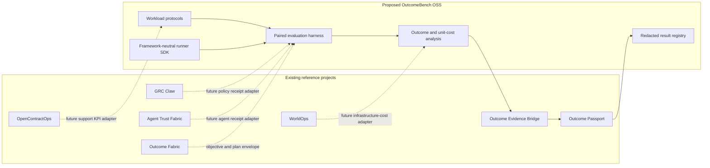
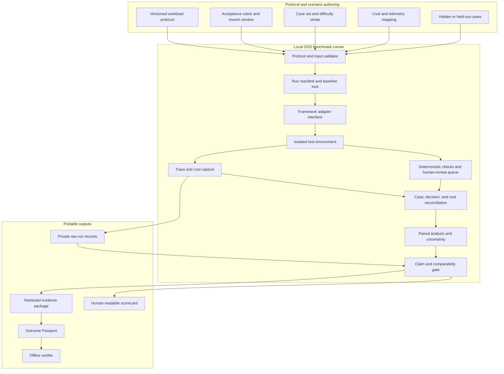
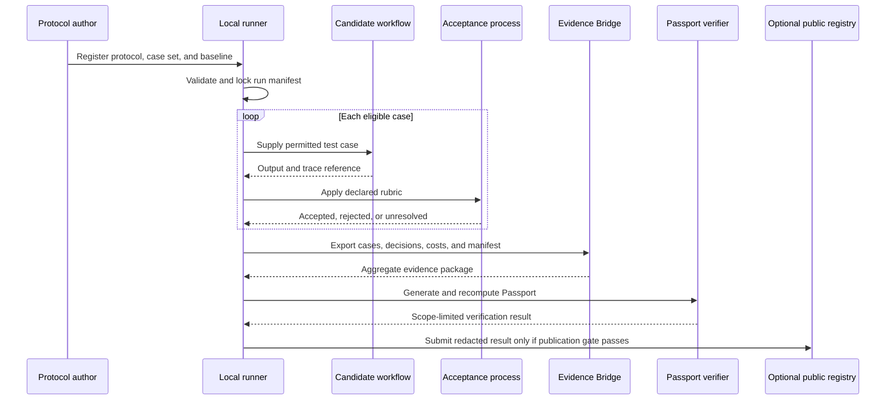
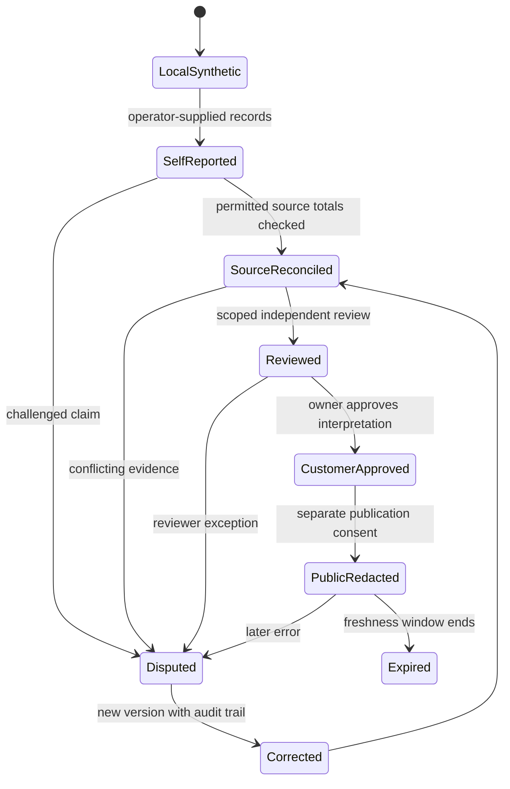
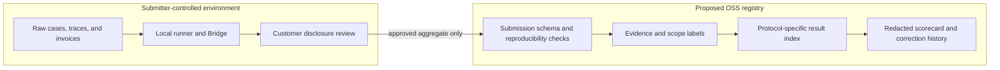
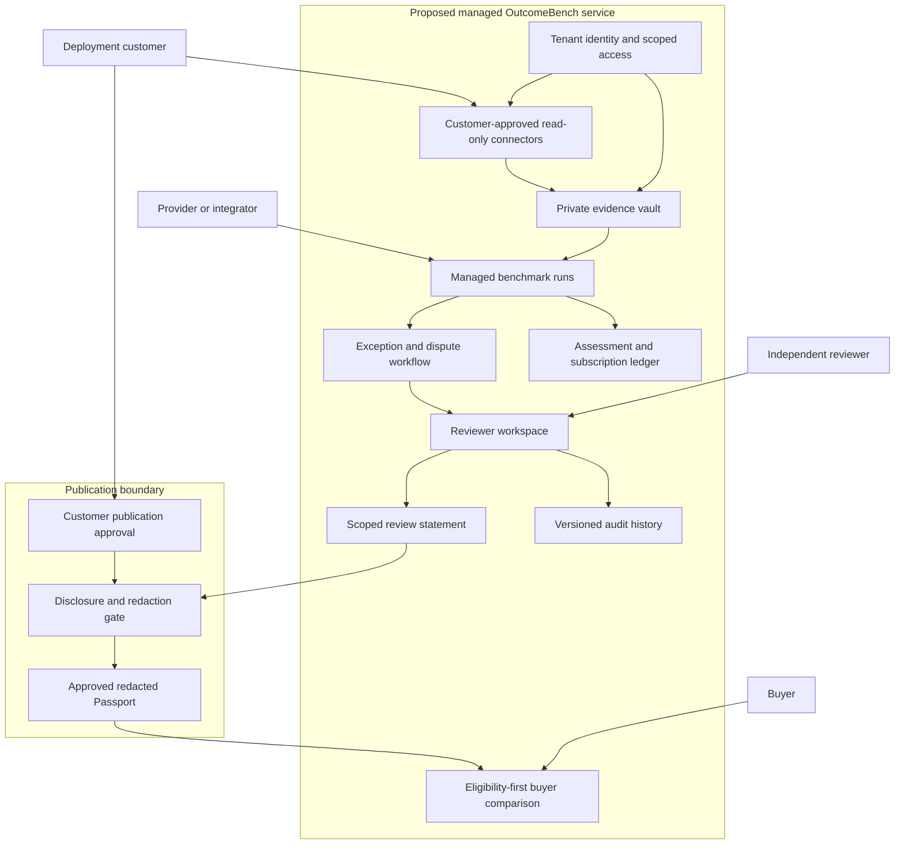
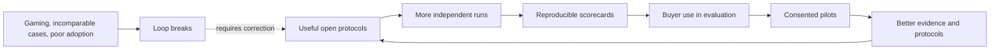

# OutcomeBench: architecture and implementation plan

**Status:** the recorded-export runner, built-in local synthetic adapters, framework-neutral prediction replay, support protocol, and a static synthetic-only results index are implemented in this monorepo. Live framework adapters, isolated execution of untrusted agents, a customer-result registry, reviewer workflow, and commercial service have **not** been implemented. The diagrams below describe the target architecture; the present code exercises only local synthetic or operator-supplied export paths.

The implemented path is reproducible with:

```bash
PYTHONPATH=src python3 -m outcome_fabric.outcomebench_cli run fixtures/bridge/manifest.json protocols/support-accepted-resolution-v1.json --output /tmp/outcomebench-scorecard.json
PYTHONPATH=src python3 -m outcome_fabric.outcomebench_cli verify fixtures/bridge/manifest.json protocols/support-accepted-resolution-v1.json /tmp/outcomebench-scorecard.json
```

The run binds a protocol file digest to the Bridge package digest and checks sample size, candidate quality floor, and exact aggregate case-mix equality. Wilson intervals are reported only when case independence is explicitly declared; the repeated synthetic fixture does not establish it, so its intervals are withheld. The tiny export fixture fails the minimum sample gate. Even a larger passing run remains descriptive, unreviewed, and unsuitable for a production recommendation.

The executable demonstration calls two deterministic Python adapters on the same 40 synthetic prompts. The adapter input excludes the fixture's expected resolution, and the generated CSVs contain only case IDs, categories, decisions, and modeled costs. This is a demonstration of execution and reconciliation, not a resistant-to-gaming evaluation: the fixture and adapters are public. The built-in adapters do not perform network calls. Caller-provided Python callables are trusted local code and are **not sandboxed**.

The prediction replay path accepts a file containing exactly one resolution code per scenario case and arm, bound to the scenario's byte digest. It does not execute the submitting framework. The static public index reruns these synthetic predictions or the built-in adapters in CI, then publishes aggregate scorecards only. See [the submission contract](OUTCOMEBENCH_SUBMISSIONS.md).

**Thesis:** benchmark the cost and quality of *accepted work*, not just model output or endpoint speed. Begin with AI-assisted customer support, where each eligible case has a prespecified acceptance decision, rework window, case category, and attributable cost. Other workload protocols may be added only after their outcome definitions can be reproduced and challenged.

## 1. Portfolio and market boundary



Dotted arrows are future interfaces, not live integrations. OutcomeBench should complement infrastructure benchmarks such as MLPerf Endpoints: those compare serving performance under load; OutcomeBench asks whether a specified workflow produced accepted work at a defensible total cost. It must not claim a unique or universal benchmark category.

## 2. Open-source component architecture



The initial adapter should accept a **local command or recorded export**. LangGraph, CrewAI, and other framework adapters are useful later, but the protocol must work without any one orchestration framework. The runner never grants production authority or executes against a customer system by default. A local replay can test an agent; a customer deployment requires a separate read-only evidence and consent process.

### Protocol contract

Each protocol version must define: workload and eligible unit; inclusion and exclusion rules; baseline and candidate treatment; case mix and difficulty strata; acceptance rubric; rework and follow-up windows; quality and safety guardrails; latency and availability limits; all-in cost categories and allocation rules; missing-data policy; minimum sample; statistical analysis plan; and permitted claims. A protocol change produces a new version and cannot silently rewrite previous results.

The support protocol should define an **accepted resolution** as a case that meets the customer-approved rubric, requires no disqualifying rework during the declared follow-up window, and passes applicable privacy and escalation guardrails. A model's self-reported completion is not acceptance evidence.

## 3. Evaluation and evidence flow



An unresolved case remains unresolved; it is never assumed successful. The run should fail closed when eligible-case counts, decisions, cost coverage, currency, or protocol versions cannot be reconciled. Raw prompts, customer tickets, personal data, and privileged material remain private and are not included in a public submission.

## 4. Metrics and comparison rules

| Dimension | Minimum reported measure | Claim boundary |
| --- | --- | --- |
| Effectiveness | Accepted cases / eligible cases | Must show exclusions and unresolved cases |
| Unit economics | Total attributable cost / accepted cases | Include inference, retrieval, infrastructure, human QA, rework, operations, and allocated setup |
| Reliability | Failure and retry rate; completed within time limit | Define the denominator and observation window |
| Quality | Rubric score distribution and disqualifying defects | Human review must disclose sampling and reviewer scope |
| Time | Median and tail completion time | Compare at the same workload and concurrency |
| Governance | Policy violations, bypass attempts, denied actions | A local receipt is not real-world identity authentication |
| Evidence | Provenance, missingness, freshness, review status | Signatures and hashes show integrity, not truth |

The headline comparison is **cost per accepted task**, subject to a minimum acceptance and safety threshold. Do not optimize a weighted composite that hides a failed guardrail. Show the baseline and candidate separately, then show a difference only when protocol version, case eligibility, case mix, and cost allocation are comparable. For randomized or paired designs, report an interval and analysis method; for observational before-and-after data, identify confounders and avoid causal wording unless the design supports it. No single score should collapse cost, quality, scope, and evidence strength into an uninspectable rank.

## 5. Evidence grades and publication state



These are **workflow states**, not automatic truth grades. Record separate dimensions for source authentication, calculation validity, review independence, customer approval, scope, and freshness. The current Passport and Bridge remain at arithmetic and local-file integrity scope. A published result must retain its protocol version, evidence class, measurement window, conflict disclosures, and correction history. Paid review never buys a higher ranking.

## 6. Public registry and private data boundary



Start with a static registry generated from pull requests, not a multi-tenant service. Public synthetic results get a separate track from customer-supplied results. A result is compared only within its protocol version and declared operating conditions. The submission checker should reject personal data fields, unsupported evidence labels, missing digests, stale versions, and results that fail the verifier. A customer-supplied submission is not automatically independently reviewed.

## 7. Commercial layer after evidence of demand



The first paid offer would be a fixed-scope **private benchmark and evidence review**, not a marketplace. Buyers can later use eligibility-first comparisons: workload fit, jurisdiction and residency, data handling, minimum quality, budget, then cost and speed tradeoffs. Commercial relationships and reviewer conflicts must be disclosed; providers cannot pay for a better evidence grade or placement.

Commercial contribution per customer should be measured as collected assessment fees and subscription revenue, minus reviewer labor, connector maintenance, compute, support, and allocated acquisition cost. Pricing, conversion, retention, and margins are hypotheses until observed in pilots.

## 8. Growth mechanism and falsification tests



This is a **conditional** network effect, not inevitable exponential growth. The falsification tests are concrete: independent teams run the protocol without assistance; buyers ask for the scorecard; results lead to an actual selection or rejection; published claims survive challenges; and paid pilots cover their delivery cost. If those do not occur, improve the workflow or narrow the market rather than creating more project names.

## 9. Implementation sequence and release gates

1. **Protocol v0.1:** support-case rubric, case-mix fixture, baseline/candidate contract, cost mapping, and invalid-input examples. Gate: two independent implementations calculate the same outcome from the same export.
2. **Local runner:** subprocess or recorded-export adapter, deterministic run manifest, trace and cost capture, complete case-to-decision reconciliation, Bridge and Passport generation. Gate: a second developer can reproduce the run offline without credentials.
3. **Adversarial suite:** duplicate and missing cases, label tampering, hidden exclusions, cost omission, changed manifests, category imbalance, and prompt-output gaming. Gate: misleading submissions fail or carry explicit limitations.
4. **Static public registry:** protocol-versioned synthetic submissions, machine-readable result files, verifier in CI, redacted scorecards, corrections. Gate: no private source data in a public submission.
5. **Read-only design partner:** one customer-approved export, locked protocol, source-total reconciliation, scoped human review. Gate: the customer can trace and challenge every reported metric.
6. **Commercial validation:** repeat with a second independent customer before building a private multi-tenant product or buyer marketplace. Gate: real buying decisions and positive contribution economics, not downloads alone.

## 10. Explicit exclusions in the first release

No production actions, autonomous purchasing, live customer connectors, biometric or surveillance data, legal-advice claims, automatic certification, universal ranking, or public upload of raw records. Those are separate products or regulated contexts with distinct authorization and evidence requirements.
