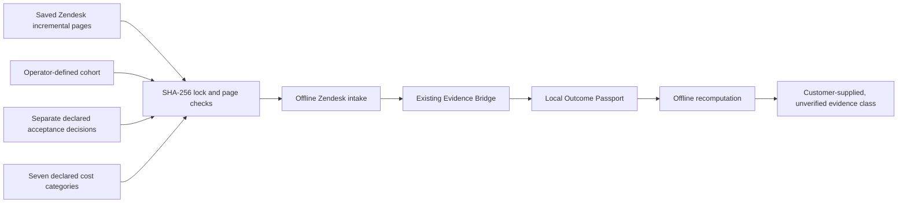
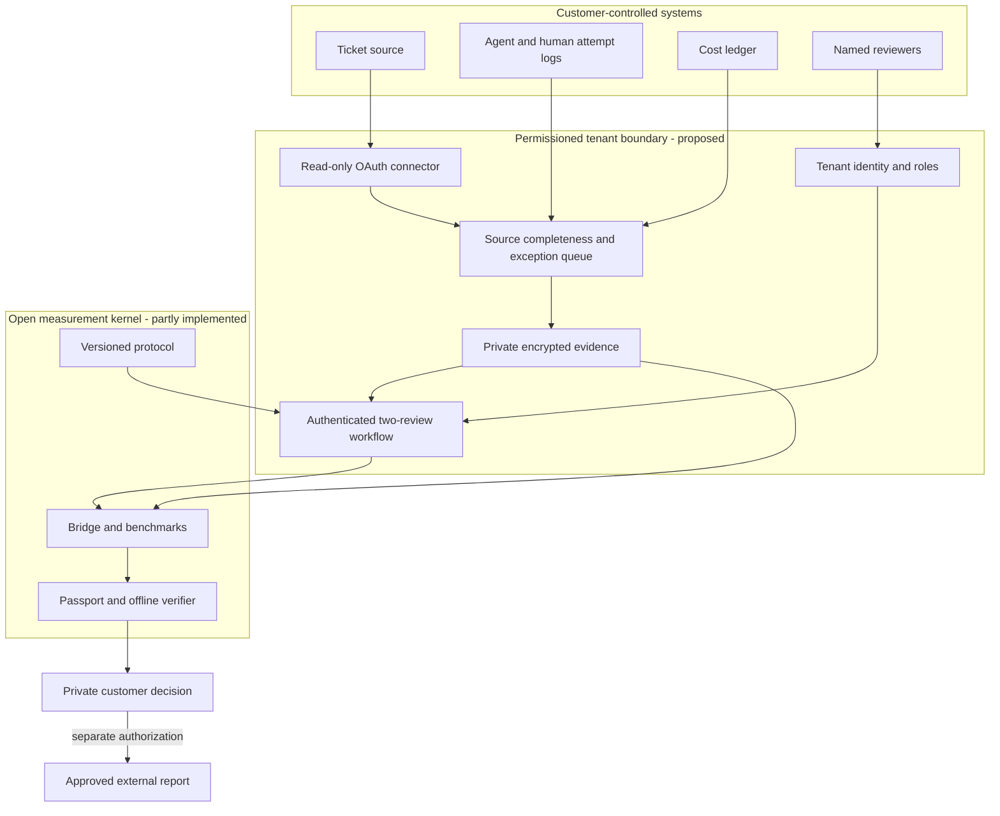

# Outcome Network: first permissioned-pilot boundary

Outcome Network is the proposed production service around the open Outcome Fabric protocol. Its first buyer workflow is **accepted AI-assisted support resolution per full attributable dollar**. The current code is an offline, read-only reference for ingesting customer-supplied Zendesk incremental ticket export pages. It does not call Zendesk, authenticate a customer, establish source completeness, or issue a public verified claim. The committed data is synthetic.

## What this release actually adds

`outcome-zendesk-intake` accepts locked local JSON pages, a manually defined eligible cohort, separate acceptance decisions, and all seven cost categories. It rejects tampered files, incomplete page sequences, unresolved cohort tickets, duplicate cohort IDs, missing decisions, and incomplete costs. A newer ticket snapshot supersedes an older one. The output is a private Bridge package with only minimal case rows; ticket subject and other source fields are not copied into the derived cases CSV. The output directory is created privately and only after the Bridge validates the complete package. `verify` re-reads every locked input and recomputes each output byte.

Zendesk's [incremental ticket export documentation](https://developer.zendesk.com/api-reference/ticketing/ticket-management/incremental_exports/) describes cursor-based pages and `end_of_stream`. This adapter consumes a saved sequence of those page shapes; it does not infer that the operator exported every relevant page. A ticket marked `solved` or `closed` is merely eligible for the declared cohort. It is **not** automatically accepted by a customer or reviewer.

```bash
PYTHONPATH=src python3 -m outcome_fabric.zendesk_intake_cli run fixtures/zendesk-intake/intake.json /tmp/outcome-network-pilot-demo
PYTHONPATH=src python3 -m outcome_fabric.zendesk_intake_cli verify fixtures/zendesk-intake/intake.json /tmp/outcome-network-pilot-demo
PYTHONPATH=src python3 -m outcome_fabric.bridge_cli build /tmp/outcome-network-pilot-demo/manifest.json --output /tmp/outcome-network-bridge-demo.json
PYTHONPATH=src python3 -m outcome_fabric.bridge_cli verify /tmp/outcome-network-pilot-demo/manifest.json /tmp/outcome-network-bridge-demo.json
```

Choose a fresh private output directory. The command refuses to overwrite a directory. Keep customer source pages, cohort, decisions, costs, derived files, and report outside the public repository. Local file permissions are restrictive, but this is not a hosted custody system.

## Current architecture and precise claim boundary



The same human who supplied an export may also have authored the decision CSV. SHA-256 establishes local file identity relative to the configuration, not source authenticity. The generated Passport remains `CUSTOMER_SUPPLIED_UNVERIFIED`, and its cost difference is descriptive, not causal.

## Production service target



The proposed hosted boundary is **not built**. In particular, a localhost alias in Acceptance Ledger is not reviewer authentication. A real deployment needs SSO/OIDC, tenant isolation, role enforcement, source-scoped credentials, credential rotation, encrypted custody, retention and deletion rules, backup recovery, abuse monitoring, independent review, and customer-controlled publication approval. None of those can be inferred from this offline intake.

## Pilot gates

1. **Data rights and protocol:** a customer approves the exact export fields, retention, eligible cohort, acceptance rule, measurement window, and cost allocation. Keep the authorization record outside the open-source report until a permission workflow is implemented.
2. **Reconciliation:** compare exported counts and page cursor boundaries with the customer's source system; investigate gaps and late updates. This release only checks the pages it receives.
3. **Independent review:** two named reviewers inspect the exact work version. A conflict needs a third reviewer. The existing local ledger demonstrates mechanics but cannot authenticate people.
4. **Unit economics:** report all attempted cases in cost, accepted cases in the denominator, human review and rework, data coverage, and case mix. Withhold causal savings claims without a credible experimental design.
5. **Repeatability:** onboard a second customer using the same protocol and adapter contract without bespoke calculation logic. Only then consider managed cross-customer comparison or procurement workflows.

Commercial value comes from operating these controls and integrations reliably. The protocol, local adapter, calculator and verifier should remain inspectable OSS. Customer records and derived results remain customer-controlled; a public case study requires a separate approval and scope review.
