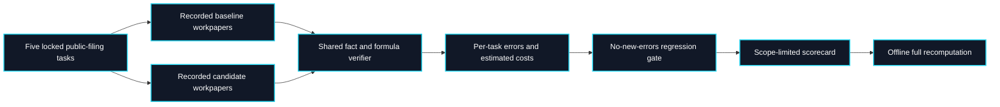

# WorkpaperCI: recorded-output finance regression gate

WorkpaperCI applies the same finance workpaper checks to a baseline and a candidate submission. Version 0.1.0 contains five Apple 10-K tasks, fiscal years 2021–2025, assembled as small locked excerpts of the public [SEC Company Facts API](https://www.sec.gov/search-filings/edgar-application-programming-interfaces). It runs **recorded JSON workpapers only**; no submitter code or model is executed. Review effort and all costs in this example are synthetic estimates. There is no human acceptance event in this benchmark.

```bash
PYTHONPATH=src python3 -m outcome_fabric.workpaperci_cli run fixtures/workpaperci/benchmark.json --output /tmp/workpaperci-scorecard.json
PYTHONPATH=src python3 -m outcome_fabric.workpaperci_cli verify fixtures/workpaperci/benchmark.json /tmp/workpaperci-scorecard.json
PYTHONPATH=src python3 -m outcome_fabric.workpaperci_cli gate fixtures/workpaperci/benchmark.json --output /tmp/workpaperci-gate.json
```

`gate` exits nonzero if the candidate adds failed claims on any task or has fewer than the configured minimum number of automatically clean tasks. The example baseline deliberately misstates one FY2023 revenue figure; the candidate passes all five tasks. Both submissions use estimated costs. The $3.05 candidate cost per automatically clean task is arithmetic over invented inputs, **not cost per analyst-accepted workpaper**.

## Architecture



The benchmark manifest locks each task and submission JSON file. Each task locks a source excerpt and a protocol. Each submission locks exactly one workpaper per task and supplies all six cost categories as decimal strings. The candidate and baseline use the same task set. Source paths are confined to the benchmark directory. WorkpaperCI checks the exact fact ID, period, unit and value for eight reported items, then recomputes operating margin from the source figures. Any malformed or incomplete submission fails closed.

## Submission contract

The complete example is [`fixtures/workpaperci/submissions/candidate.json`](../fixtures/workpaperci/submissions/candidate.json). A submission has:

```json
{
  "schema_version": "0.1.0",
  "submission_id": "my-agent-version",
  "adapter_kind": "RECORDED_OUTPUT_NO_CODE_EXECUTION",
  "cost_basis": "SYNTHETIC_ESTIMATE",
  "runs": [
    {
      "task_id": "apple-fy2025",
      "workpaper": {"path": "submissions/my-agent/apple-2025.json", "sha256": "<64 lowercase hex characters>"},
      "costs": {"model": "0.20", "data": "0.00", "compute": "0.05", "review": "2.00", "rework": "0.30", "allocated_setup": "0.50"}
    }
  ]
}
```

`runs` must cover **all five** task IDs exactly once. The JSON above illustrates one row; it is not itself a complete submission. Keep all workpaper files within the benchmark directory, update their hashes and the enclosing submission hash, then change the benchmark's candidate lock. The supplied costs are explicitly estimates. This contract does not yet accept measured invoices or authenticated reviewer records.

## Scoring and claim limits

For each task, WorkpaperCI reports passed checks, failed claims, failure codes, and an estimated cost. The gate compares each candidate task with the corresponding baseline task. It fails on a per-task increase in failed claims even if aggregate quality improves elsewhere. A separate minimum-clean-task threshold prevents an all-failing baseline from making a poor candidate appear acceptable.

Estimated cost per automatically clean task equals **total estimated cost across every attempted task divided by the number of automatically clean tasks**. Failed attempts remain in the numerator. No result is called analyst-accepted; the scorecard fixes `human_accepted_workpapers` at zero. There is no statistical confidence interval, causal cost claim, production readiness claim, or investment recommendation. These five tasks share one issuer and public snapshot, so they do not represent the breadth or independence needed for a general finance-agent ranking.

The [Finance Workpaper Passport](FINANCE_WORKPAPER.md) remains the single-workpaper provenance reference. WorkpaperCI adds a repeatable, provider-neutral regression loop. A later release can add independently reviewed tasks, authenticated review, wider issuer coverage, measured costs, and licensed-data handling. Those additions require new evidence classes and protocols, rather than relabeling this synthetic reference.
